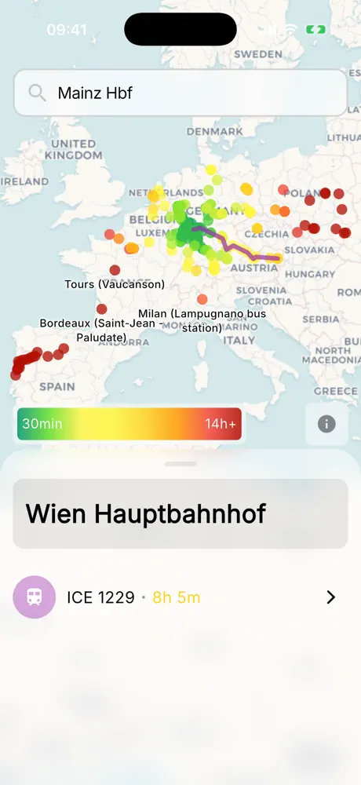
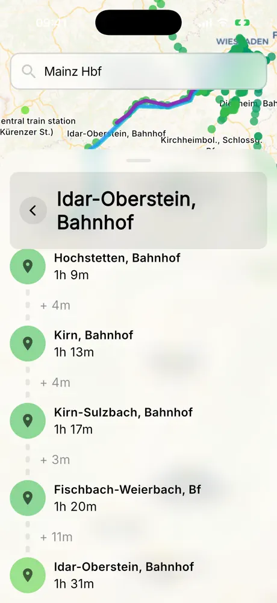

<p align="center">
  
</p>

<h1 align="center">Station Reach</h1>

<p align="center">
  Search a public transit station, see every departure leaving it, and watch the whole reachable
  network appear on a map coloured by travel time.
</p>

<p align="center">
  <a href="LICENSE">
    
  </a>
  <a href="https://github.com/ton-An/station_reach/stargazers">
    
  </a>
</p>

<div align="center">
  <a href="https://station-reach.eu">Homepage</a>
</div>

## Screenshots

<div>



</div>

## Website & Download

### Website

https://station-reach.eu

### iOS

https://apps.apple.com/de/app/station-reach/id6752408029?l=en-GB

### Android

Station Reach is currently in **closed testing** on Google Play. To participate, join the Google
Group [station-reach-testers@googlegroups.com](https://groups.google.com/g/station-reach-testers),
then the test on Google Play:
https://play.google.com/apps/testing/eu.antons_webfabrik.station_reach

Google Play requires at least 12 testers to move forward, so your help is greatly appreciated!

## Stack

| Concern | Choice |
| --- | --- |
| Runtime | Expo (managed) + expo-router |
| Language | TypeScript, `strict` |
| Targets | iOS, Android, Web (react-native-web) |
| State | Zustand |
| Errors | `neverthrow` |
| Map | MapLibre — native bindings and GL JS behind one wrapper |
| Data | [Transitous](https://transitous.org/) (MOTIS) public REST API |

There is no backend and no API key: the app talks to Transitous directly.

## Getting started

### Prerequisites

- Node.js and npm
- The [Expo CLI workflow](https://docs.expo.dev/get-started/set-up-your-environment/) — Xcode for
  iOS, Android Studio for Android

### Run it

```bash
git clone https://github.com/ton-An/station_reach.git
cd station_reach
npm install
npm start            # dev server; press i / a / w
```

Or straight to one target:

```bash
npm run ios
npm run android
npm run web
```

### Checks

```bash
npm run typecheck
npm run lint
```

### Release builds

Builds go through [EAS](https://docs.expo.dev/build/introduction/):

```bash
eas build -p ios
eas build -p android
```

## Contributing

1. Read [AGENTS.md](AGENTS.md) — architecture, conventions and verification live there, with
   scoped files under `src/core/` and `src/features/map/`.
2. Fork the repository.
3. Create a branch (`git checkout -b feat/amazing-feature`).
4. Commit in Conventional Commits style (`git commit -m 'feat: add amazing feature'`).
5. Open a pull request.

## License

MIT — see [LICENSE](LICENSE).

## Acknowledgments

- [Transitous](https://transitous.org/) for providing the API
- [Transitous data sources](https://transitous.org/sources/)
- [OpenStreetMap contributors](https://www.openstreetmap.org/) for map data
- [CARTO](https://carto.com/attribution) for the basemap style
