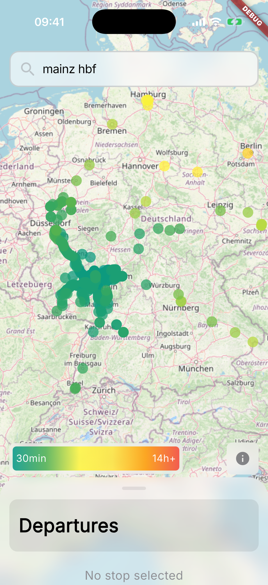
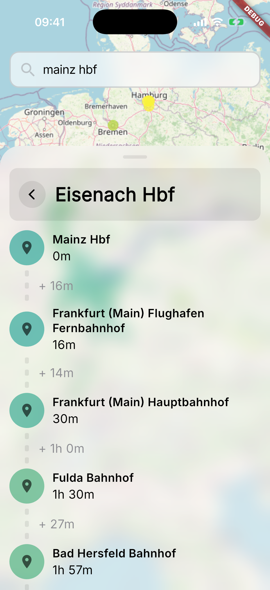

<p align="center">
  
</p>

<h1 align="center">Station Reach</h1>

<p align="center">
  A Flutter app that helps users discover public transit stations and visualize their reach on a map.
</p>

<p align="center">
  <a href="LICENSE">
    
  </a>
  <a href="https://github.com/ton-An/fernwaerts/stargazers">
    
  </a>
</p>

<div align="center">
  <s>Homepage</s> • 
  <s>Planning</s> • 
  <s>Documentation</s>
</div>


## Screenshots

<div>




</div>

## Download

### iOS
Join the TestFlight beta here: https://testflight.apple.com/join/2cSdXKCM

### Android
Will be available soon!

## Getting Started (Development)

> 🚧 Only iOS and Android are supported at the moment

### Prerequisites

- Flutter & Dart SDK (https://docs.flutter.dev/get-started/install)

### Installation

1. Clone the repository:
   ```bash
   git clone https://github.com/your-username/station_reach.git
   cd station_reach
   ```

2. Install dependencies:
   ```bash
   flutter pub get
   ```

3. Run the app:
   ```bash
   flutter run
   ```

### Building for Production

#### iOS
```bash
flutter build ipa
```

#### Android
```bash
flutter build apk
```

## Contributing

1. Fork the repository
2. Create a feature branch (`git checkout -b feature/amazing-feature`)
3. Commit your changes (`git commit -m 'Add some amazing feature'`)
4. Push to the branch (`git push origin feature/amazing-feature`)
5. Open a Pull Request


## License

This project is licensed under the MIT License - see the [LICENSE](LICENSE) file for details.

## Acknowledgments
- [Transitous](https://transitous.org/) for providing the API
- [Transitous Data Sources](https://transitous.org/sources/)
- [OpenStreetMap contributors](https://www.openstreetmap.org/)  for map data